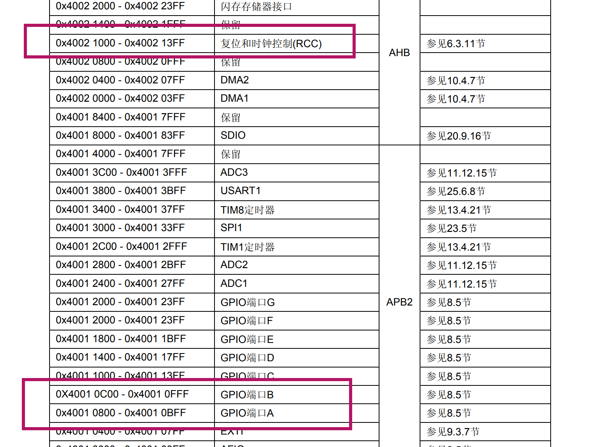
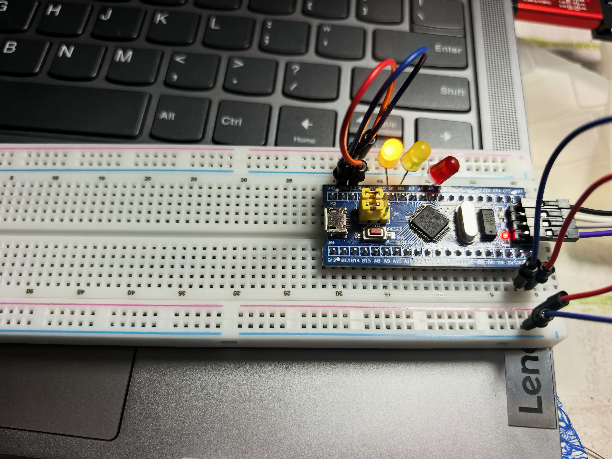

# STM32用寄存器的方式点亮流水灯

## 一、实验简介

​        学习 STM32，从寄存器操作流水灯是最基础的入门实验。库函数把寄存器做了封装，屏蔽底层细节；直接操作寄存器地址，可以真正理解 GPIO、时钟寄存器工作机制。 本实验使用 PA5、PB0、PB1三个引脚外接 LED，实现三个灯轮流闪烁，间隔大约 1s。

## 二、实验原理

### 1、总线部分

该图为 STM32 时钟树，展示各外设总线时钟来源，GPIO 挂载在 APB2 总线上。


### 2、配置时钟

 实验全部采用**GPIOA 端口**，PA0、PA3、PA7 三个引脚。GPIOA 属于 APB2 总线，使用 GPIO 外设前，**必须开启 GPIOA 端口的 APB2 时钟**。

打开STM32参考手册查找到相关资料

①查找到时钟使能端口的地址


②查找到APB2寄存器的偏移地址以及对应的端口所在的位置


本次实验需要 GPIOA、GPIOB，所以设置以下代码来开启时钟：

```c
RCC_APB2ENR |= (1<<2) | (1<<3);
```

### 3、输入输出设置

①GPIOx_CRL 寄存器负责管理 Pin0~Pin7 的 IO 口模式。每一个引脚要占 4 个 bit 位，一部分设置功能，一部分设置输出速度。


引脚模式配置：

```c
//PA5 推挽输出2MHz
GPIOA_CRL &= ~(0x0F << 20);
GPIOA_CRL |=  (0x01 << 20);

//PB0 推挽输出2MHz
GPIOB_CRL &= ~(0x0F << 0);
GPIOB_CRL |=  (0x01 << 0);

//PB1 推挽输出2MHz
GPIOB_CRL &= ~(0x0F << 4);
GPIOB_CRL |=  (0x01 << 4);
```

②GPIOx_ODR 输出寄存器，控制引脚输出高低电平，实现 LED 亮灭。


系统上电后引脚状态不确定，所以初始化阶段把 PA5、PB0、PB1 全部置高电平，保证三个 LED 一开始处于熄灭状态：

```c
//全部LED初始熄灭，输出高电平
GPIOA_ODR |= (1<<5);
GPIOB_ODR |= (1<<0) | (1<<1);
```

### 4.寄存器内存映射与 volatile 关键字

STM32 所有外设都有固定的内存地址，我们直接写地址访问硬件。 `volatile`作用就是告诉编译器，不要去优化这段代码，每次都实实在在去读硬件寄存器，灯没反应。

手册已经给出了各个外设的硬件物理地址，我们代码直接照搬地址。



```c
//APB2使能时钟寄存器
#define RCC_APB2ENR  (*(volatile unsigned int *)0x40021018)

//GPIOA配置寄存器
#define GPIOA_CRL    (*(volatile unsigned int *)0x40010800)
#define GPIOA_ODR    (*(volatile unsigned int *)0x4001080C)

//GPIOB配置寄存器
#define GPIOB_CRL    (*(volatile unsigned int *)0x40010C00)
#define GPIOB_ODR    (*(volatile unsigned int *)0x40010C0C)
```

### 5、延时函数

单片机没有sleep函数，所以采用空循环实现延时，实现1秒的粗略延时。

```c
//软件粗略延时，72MHz主频，约1s
void Delay(void)
{
    unsigned int i=0;
    for(i=0;i<5000000;i++);
}
```

### 6、GPIO初始化函数

单片机上电之后，首先要跑初始化函数。先开时钟，再设置引脚模式，最后把灯全部灭掉。

```c
//GPIO初始化 PA5 PB0 PB1推挽输出2MHz
void LED_GPIO_Init(void)
{
    //开启GPIOA、GPIOB时钟
    RCC_APB2ENR |= 1<<2 | 1<<3;

    //PA5 推挽输出2MHz
    GPIOA_CRL &= ~(0x0F << 20);
    GPIOA_CRL |=  (0x01 << 20);

    //PB0 推挽输出2MHz
    GPIOB_CRL &= ~(0x0F << 0);
    GPIOB_CRL |=  (0x01 << 0);

    //PB1 推挽输出2MHz
    GPIOB_CRL &= ~(0x0F << 4);
    GPIOB_CRL |=  (0x01 << 4);

    //全部LED初始熄灭，输出高电平
    GPIOA_ODR |= (1<<5);
    GPIOB_ODR |= (1<<0) | (1<<1);
}
```

### 7、main主函数

程序的入口为 main 函数，使用`while(1)`死循环不断执行任务。轮流点亮一个 LED，其余熄灭，调用延时，循环往复实现流水灯效果。

```c
int main(void)
{
    LED_GPIO_Init();
    while(1)
    {
        //PA5亮，PB0 PB1灭
        GPIOA_ODR &= ~(1<<5);
        GPIOB_ODR |=  (1<<0) | (1<<1);
        Delay();

        //PB0亮，PA5 PB1灭
        GPIOA_ODR |=  (1<<5);
        GPIOB_ODR &= ~(1<<0);
        GPIOB_ODR |=  (1<<1);
        Delay();

        //PB1亮，PA5 PB0灭
        GPIOA_ODR |=  (1<<5);
        GPIOB_ODR |=  (1<<0);
        GPIOB_ODR &= ~(1<<1);
        Delay();
    }
}
```

## 三、完整实验代码

```c
//APB2使能时钟寄存器
#define RCC_APB2ENR  (*(volatile unsigned int *)0x40021018)

//GPIOA配置寄存器
#define GPIOA_CRL    (*(volatile unsigned int *)0x40010800)
#define GPIOA_ODR    (*(volatile unsigned int *)0x4001080C)

//GPIOB配置寄存器
#define GPIOB_CRL    (*(volatile unsigned int *)0x40010C00)
#define GPIOB_ODR    (*(volatile unsigned int *)0x40010C0C)

//软件延时函数，循环空等待，粗略延时约1s
void Delay(void)
{
    unsigned int i=0;
    for(i=0;i<5000000;i++);
}

int main(void)
{
    //1.开启GPIOA、GPIOB APB2时钟
    RCC_APB2ENR |= 1<<2 | 1<<3;

    //2.配置PA5为推挽输出，2MHz
    GPIOA_CRL &= ~(0x0F << 20);
    GPIOA_CRL |=  (0x01 << 20);

    //3.配置PB0为推挽输出，2MHz
    GPIOB_CRL &= ~(0x0F << 0);
    GPIOB_CRL |=  (0x01 << 0);

    //4.配置PB1为推挽输出，2MHz
    GPIOB_CRL &= ~(0x0F << 4);
    GPIOB_CRL |=  (0x01 << 4);

    //初始状态，全部LED熄灭（输出高电平）
    GPIOA_ODR |= (1<<5);
    GPIOB_ODR |= (1<<0) | (1<<1);

    while(1)
    {
        //PA5灯亮，PB0、PB1熄灭
        GPIOA_ODR &= ~(1<<5);
        GPIOB_ODR |=  (1<<0) | (1<<1);
        Delay();

        //PB0灯亮，PA5、PB1熄灭
        GPIOA_ODR |=  (1<<5);
        GPIOB_ODR &= ~(1<<0);
        GPIOB_ODR |=  (1<<1);
        Delay();

        //PB1灯亮，PA5、PB0熄灭
        GPIOA_ODR |=  (1<<5);
        GPIOB_ODR |=  (1<<0);
        GPIOB_ODR &= ~(1<<1);
        Delay();
    }
}
```

## 四、开发板运行效果



## 五、实验总结

这次直接操作寄存器写流水灯，跟以前直接复制库函数代码跑实验的体验完全不一样，也踩了不少小坑。之前总直接用库，不用关心底层寄存器，做完这个实验才真正体会到STM32必须开时钟这个关键点，一开始我也差点忽略，要是不开时钟，后面写再多IO配置代码都是白费功夫。配置CRL寄存器的时候我也学到，不能直接赋值，得先把旧的位清空再写新配置，不然残留的旧设置会让引脚工作异常。volatile这个关键字以前只是课本看到，这次才明白它的实际用处，防止编译器自作优化，保证真正去读写硬件寄存器。实验用的软件延时写起来省事，但缺点也很明显，延时不准，只能拿来做演示。真正做项目肯定不能这么用，还是要靠定时器。对照参考手册对着寄存器地址一步步调试，让我对存储器映射、位操作有了实实在在的理解，不再是纸上概念，也为之后学STM32积累了底层思路。
